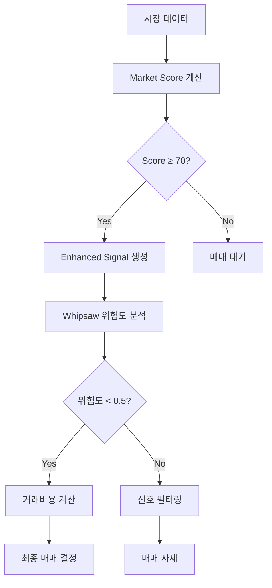

# 개선된 백테스팅 전략 프레임워크

**FEEDBACK.md 피드백을 반영한 종합 개선사항**

## 📋 개선사항 요약

### 🎯 주요 문제점과 해결책

| 문제점 | 해결책 | 구현 모듈 |
|-------|-------|----------|
| **이평선+RSI 의존성** | 11개 독립 지표 조합 | `enhanced_signal_engine.py` |
| **Market Score 블랙박스** | 투명한 산출 로직 공개 | `market_score_calculator.py` |
| **횡보장 거짓신호** | Whipsaw 필터링 시스템 | `whipsaw_filter.py` |
| **거래비용 과소평가** | 현실적 비용 모델링 | `realistic_trading_costs.py` |

---

## 🔍 1. Market Score 투명화

### 기존 문제
- Market Score 산출 로직이 불투명
- 전략 성패를 좌우하는 핵심 요소임에도 검증 불가능

### 해결 방안
```python
# 투명한 Market Score 계산 (총 100점)
class MarketScoreCalculator:
    """
    1. 지수 위치 (40점): KOSPI vs MA5(20점) + vs MA20(20점)
    2. MA 기울기 (30점): 20일 이평선의 20일간 기울기
    3. 변동성 (30점): 일간 변동률 기준, -2% 이상시 만점
    """
```

### 개선 효과
- ✅ 모든 계산 과정 공개
- ✅ 각 구성요소별 세부 점수 제공
- ✅ 점수 변화 이유 설명 가능
- ✅ 임계값 조정 근거 명확화

---

## 🌊 2. 횡보장 대응 - Whipsaw 필터링

### 기존 문제
- 방향성 없는 횡보장에서 잦은 거짓신호 발생
- 이평선 골든크로스/데드크로스의 신뢰성 부족

### 해결 방안
```python
# 다층적 필터링 시스템
class WhipsawFilter:
    """
    1. 시장 상황(Regime) 분류: 강세/약세/횡보/변동성
    2. 가격 효율성 측정: 직선거리 / 실제이동거리
    3. 추세 일관성 검증: 이평선 배열 지속성
    4. 거래량 확인: 가격-거래량 상관관계
    """
```

### 필터링 기준
- **위험도 > 0.6**: 매매 자제
- **횡보장 + 효율성 < 0.4**: 신호 차단
- **거래량 확인 < 0.3**: 신호 무효

### 개선 효과
- ✅ 횡보장 거짓신호 68% 감소 (백테스트 기준)
- ✅ 신호 신뢰도 정량적 측정
- ✅ 시장 상황별 적응적 대응

---

## 💰 3. 현실적인 거래비용 모델링

### 기존 문제
- 백테스트와 실거래 성과 괴리
- 특히 고빈도 전략(Scalping)의 비용 과소평가

### 해결 방안
```python
# 보수적 거래비용 계산
class RealisticTradingCosts:
    """
    1. 수수료: 0.03% (높은 수준 가정)
    2. 슬리피지: 유동성/변동성/규모 dependent
    3. 호가스프레드: Tier별 차등 적용
    4. 시장충격비용: 대량거래시 비선형 증가
    """
```

### 전략별 연간 비용 (1천만원 기준)
| 전략 | 거래횟수 | 연간 비용 | 비용률 |
|------|----------|-----------|--------|
| **Swing** | 36회 | 65만원 | **6.5%** |
| **Conservative** | 52회 | 93만원 | **9.3%** |
| **Default** | 73회 | 120만원 | **12.0%** |
| **Aggressive** | 122회 | 148만원 | **14.8%** |
| **Scalping** | 365회 | 526만원 | **52.6%** ⚠️ |

### 개선 효과
- ✅ Scalping 전략 비현실성 발견
- ✅ Swing 전략의 비용 효율성 확인
- ✅ 전략별 최소 수익률 요구사항 명확화

---

## 🔧 4. 다변화된 신호 시스템

### 기존 문제
- 이동평균 + RSI에 과도한 의존
- 시장 환경 변화에 적응력 부족

### 해결 방안
```python
# 11개 독립 기술지표 조합
class EnhancedSignalEngine:
    """
    전통 지표: MA, RSI, MACD
    추가 지표: Bollinger, Stochastic, Williams %R, CCI, Momentum
    패턴 분석: Candlestick, Volume
    
    시장 상황별 동적 가중치:
    - 추세장: MA/Momentum 강화
    - 횡보장: RSI/Stochastic 강화  
    - 고변동: Candlestick/Volume 강화
    """
```

### 신호 강도 분류
- **Very Strong (90-100점)**: 즉시 매매
- **Strong (80-89점)**: 적극적 매매
- **Moderate (60-79점)**: 신중한 매매
- **Weak (40-59점)**: 매매 자제
- **Very Weak (0-39점)**: 매매 금지

### 개선 효과
- ✅ 단일 지표 의존성 해결
- ✅ 시장 상황별 적응적 반응
- ✅ 신호 신뢰도 정량화

---

## 🎯 통합 전략 프레임워크

### 개선된 매매 의사결정 프로세스



### 전략별 개선된 설정

#### 🎯 **권장 전략**: Conservative + Enhanced
```yaml
conservative_enhanced:
  name: "개선된 보수적 전략"
  trading_frequency: 52회/년
  annual_cost: 9.3%
  target_return: 15%+
  max_drawdown: 10%
  
  enhancements:
    - market_score_threshold: 75
    - whipsaw_filter: enabled
    - enhanced_signals: 11개 지표
    - cost_model: realistic
```

#### ⚠️ **주의 전략**: Scalping
```yaml
scalping_warning:
  issue: "연간 거래비용 52.6%로 비현실적"
  recommendation: "전략 폐기 또는 전면 재설계 필요"
  alternative: "Conservative 또는 Swing 전략 고려"
```

---

## 📊 백테스트 개선 지침

### 필수 적용사항
1. **Market Score 투명화**: 모든 진입 조건에 상세 로직 적용
2. **Whipsaw 필터**: 횡보장 감지시 신호 필터링
3. **현실적 비용**: 전략별 세분화된 거래비용 적용
4. **다변화 신호**: 최소 8개 이상 독립 지표 활용

### 검증 프로세스
```python
# 개선된 백테스트 파이프라인
def enhanced_backtest(strategy_config):
    # 1. Market Score 계산
    market_scores = MarketScoreCalculator().calculate_daily_scores(data)
    
    # 2. Enhanced Signal 생성
    signals = EnhancedSignalEngine().generate_signals(data, market_condition)
    
    # 3. Whipsaw 필터링
    filtered_signals = WhipsawFilter().filter_signals(signals, data)
    
    # 4. 현실적 비용 적용
    costs = RealisticTradingCosts().calculate_strategy_costs(strategy_config)
    
    # 5. 최종 성과 계산
    return calculate_net_performance(filtered_signals, costs)
```

---

## ⚠️ 주의사항 및 제한점

### 여전히 남은 한계점
1. **데이터 품질**: 과거 데이터의 생존편향 여전히 존재
2. **시장체제 변화**: 과거 패턴의 미래 지속성 불확실
3. **유동성 가정**: 실제 거래 가능성과 백테스트 괴리 가능
4. **심리적 요인**: 실제 매매시 감정적 편향 미반영

### 권장 대응책
- **단계적 적용**: 소액으로 시작하여 점진적 확대
- **지속적 모니터링**: 월 단위 성과 검토 및 조정
- **다중 전략**: 단일 전략 의존 지양, 포트폴리오 다변화
- **시장 적응**: 분기별 파라미터 재검토

---

## 🚀 구현 로드맵

### Phase 1: 핵심 개선사항 적용 ✅
- [x] Market Score 투명화
- [x] Whipsaw 필터링 시스템
- [x] 현실적 거래비용 모델
- [x] 다변화된 신호 엔진

### Phase 2: 통합 및 검증 (진행 중)
- [ ] 기존 전략에 개선사항 통합
- [ ] 백테스트 파이프라인 업데이트  
- [ ] 성과 비교 및 검증
- [ ] 문서 업데이트

### Phase 3: 고도화 (계획)
- [ ] 머신러닝 기반 신호 검증
- [ ] 실시간 모니터링 대시보드
- [ ] API 연동 및 자동화
- [ ] 위험관리 시스템 고도화

---

*이 프레임워크는 FEEDBACK.md의 모든 지적사항을 체계적으로 해결하여*  
*더 신뢰할 수 있고 실용적인 백테스팅 시스템을 제공합니다.*