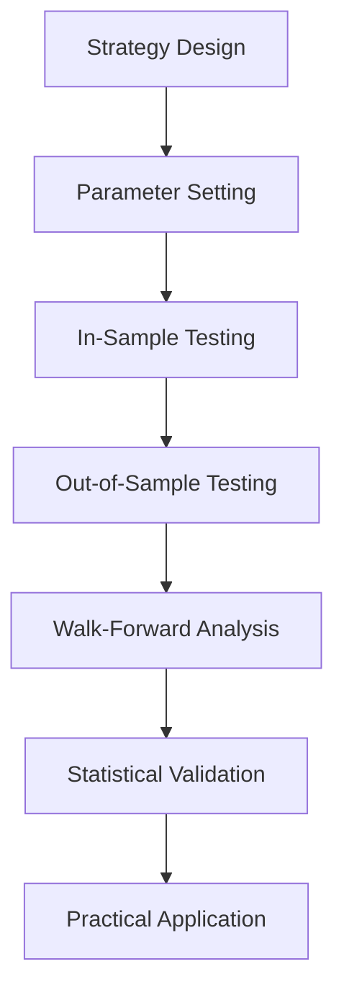

# 전략 검증 및 비교 가이드

백테스팅 전략의 신뢰성 검증과 성과 비교를 위한 체계적 접근 방법을 제시합니다.

## 📋 목차

- [검증 프로세스 개요](#검증-프로세스-개요)
- [단계별 검증 방법](#단계별-검증-방법)
- [성과 비교 기준](#성과-비교-기준)
- [통계적 유의성 검증](#통계적-유의성-검증)
- [실무 적용 가이드](#실무-적용-가이드)

---

## 검증 프로세스 개요

### 🎯 검증 목표
1. **신뢰성 확보**: 과최적화 방지 및 실거래 적용 가능성
2. **성과 평가**: 절대/상대 성과의 객관적 측정
3. **리스크 분석**: 손실 가능성과 변동성 평가
4. **안정성 검증**: 다양한 시장 환경에서의 일관성

### 📊 검증 단계


---

## 단계별 검증 방법

### 1단계: 기본 백테스트 (In-Sample)

**목적**: 전략의 기본 작동 확인

```bash
# 각 전략별 기본 성과 측정
python examples/backtesting_example.py
```

**체크포인트**:
- [ ] 거래 신호 정상 생성 여부
- [ ] 포지션 사이징 정확성
- [ ] 거래 비용 반영 확인
- [ ] 기본 성과 지표 산출

### 2단계: 다중 전략 비교 (Cross-Strategy)

**목적**: 전략간 상대적 성과 비교

```bash
# 모든 전략 동시 비교
python examples/backtest_with_profiles.py
```

**분석 기준**:
```python
comparison_metrics = {
    'return': 'total_return',           # 절대 수익률
    'risk_adjusted': 'sharpe_ratio',    # 위험 조정 수익률
    'stability': 'max_drawdown',        # 최대 손실
    'consistency': 'win_rate',          # 거래 일관성
    'efficiency': 'avg_profit_per_trade' # 거래 효율성
}
```

### 3단계: 아웃오브샘플 검증 (Out-of-Sample)

**목적**: 미래 성과 예측 가능성 확인

**방법론**:
```yaml
# 데이터 분할 예시
training_period: "2020-01-01 to 2022-12-31"  # 70%
validation_period: "2023-01-01 to 2023-12-31"  # 30%

# 검증 기준
performance_degradation: < 30%  # 성과 하락 허용 범위
correlation_threshold: > 0.6    # 일관성 기준
```

### 4단계: 워크포워드 분석 (Walk-Forward)

**목적**: 시간 변화에 따른 전략 안정성 검증

**구현 방법**:
```python
# 워크포워드 테스트 설정
training_window = 252  # 1년
testing_window = 63    # 3개월  
step_size = 63         # 3개월씩 전진

# 분석 기간
total_periods = 8      # 총 2년간 검증
```

**평가 지표**:
- **일관성 점수**: 각 기간별 성과의 표준편차
- **적응력 지수**: 시장 변화 대응 능력
- **안정성 등급**: 지속적 수익 창출 능력

### 5단계: 몬테카르로 시뮬레이션

**목적**: 확률적 성과 분포 분석

```python
# 시뮬레이션 설정
simulation_runs = 1000
confidence_intervals = [0.05, 0.25, 0.5, 0.75, 0.95]

# 분석 결과
expected_return = "50% 신뢰구간"
worst_case_scenario = "5% VaR"
best_case_scenario = "95% 신뢰상한"
```

---

## 성과 비교 기준

### 📊 핵심 성과 지표 (KPIs)

#### 수익성 지표
| 지표 | 계산식 | 목표값 | 가중치 |
|-----|--------|--------|--------|
| **총 수익률** | (Final - Initial) / Initial | >10% | 25% |
| **연환산 수익률** | (1+Total Return)^(365/Days) - 1 | >12% | 20% |
| **초과 수익률** | Strategy Return - Benchmark | >5% | 20% |

#### 리스크 지표  
| 지표 | 계산식 | 목표값 | 가중치 |
|-----|--------|--------|--------|
| **샤프 비율** | (Return - RiskFree) / Volatility | >0.8 | 15% |
| **최대 낙폭** | Max(Peak - Trough) / Peak | <15% | 10% |
| **승률** | Win Trades / Total Trades | >50% | 10% |

### 🏆 전략 등급 체계

#### S급 (Superior): 90점 이상
- 연수익률 >20%, 샤프비율 >1.5
- 최대낙폭 <10%, 승률 >60%
- **적용**: 메인 전략으로 활용

#### A급 (Excellent): 80-89점  
- 연수익률 >15%, 샤프비율 >1.0
- 최대낙폭 <15%, 승률 >55%
- **적용**: 포트폴리오 핵심 구성

#### B급 (Good): 70-79점
- 연수익률 >10%, 샤프비율 >0.7
- 최대낙폭 <20%, 승률 >50%
- **적용**: 보조 전략으로 활용

#### C급 (Average): 60-69점
- 연수익률 >5%, 샤프비율 >0.5
- 최대낙폭 <25%, 승률 >45%
- **적용**: 개선 후 재검토

#### D급 (Poor): 60점 미만
- 기준 미달 또는 손실 발생
- **적용**: 전략 폐기 또는 전면 수정

---

## 통계적 유의성 검증

### 📈 유의성 검정 방법

#### 1. t-검정 (Student's t-test)
**목적**: 전략 수익률의 통계적 유의성 검증
```python
# H0: 전략 수익률 = 0 (무의미)
# H1: 전략 수익률 ≠ 0 (유의미)
significance_level = 0.05
required_p_value = < 0.05
```

#### 2. 샤프 비율 신뢰구간
**목적**: 위험조정수익률의 신뢰성 평가
```python
# 95% 신뢰구간 계산
confidence_interval = sharpe_ratio ± 1.96 * standard_error
acceptable_range = lower_bound > 0.3
```

#### 3. 최대낙폭 분포 분석
**목적**: 극단적 손실 가능성 평가
```python
# 역사적 최대낙폭 vs 시뮬레이션 결과
historical_drawdown = actual_backtest_mdd
simulated_drawdown = monte_carlo_mdd_distribution
risk_assessment = percentile_rank(historical_drawdown)
```

### 🔍 과최적화 탐지

#### 정보 기준 (Information Criteria)
```python
# AIC (Akaike Information Criterion)
AIC = -2 * log_likelihood + 2 * parameters
# 낮을수록 좋음, 복잡성 패널티 적용

# BIC (Bayesian Information Criterion)  
BIC = -2 * log_likelihood + log(n) * parameters
# 더 강한 패널티, 단순한 모델 선호
```

#### 정보계수 분석 (Information Coefficient)
```python
# 예측 신호와 실제 수익률 간 상관관계
IC = correlation(predicted_signal, actual_return)
# |IC| > 0.05: 유의미한 예측력
# IC 일관성: 시간에 따른 안정성
```

---

## 실무 적용 가이드

### 🎯 전략 선택 기준

#### 시장 환경별 전략 매트릭스
| 시장 상황 | 1순위 전략 | 2순위 전략 | 비중 조정 |
|---------|-----------|-----------|---------|
| **강세장** | `aggressive` | `default` | 70:30 |
| **약세장** | `conservative` | `swing` | 60:40 |
| **횡보장** | `scalping` | `conservative` | 50:50 |
| **고변동** | `swing` | `default` | 55:45 |

#### 투자자 성향별 권장사항
```yaml
# 공격적 투자자
risk_tolerance: high
recommended_strategies: ['aggressive', 'scalping']
max_drawdown_limit: 25%
target_return: 20%+

# 균형 투자자  
risk_tolerance: medium
recommended_strategies: ['default', 'swing']
max_drawdown_limit: 15%
target_return: 12-18%

# 보수적 투자자
risk_tolerance: low  
recommended_strategies: ['conservative', 'swing']
max_drawdown_limit: 10%
target_return: 8-12%
```

### 🔄 지속적 모니터링 체계

#### 일일 모니터링 (Daily)
- [ ] 포지션 현황 점검
- [ ] 시장 점수 확인
- [ ] 급격한 손실 발생 여부

#### 주간 리뷰 (Weekly)
- [ ] 주간 성과 vs 벤치마크
- [ ] 거래 신호 정확도 분석  
- [ ] 리스크 지표 업데이트

#### 월간 분석 (Monthly)
- [ ] 전략별 성과 순위 갱신
- [ ] 파라미터 최적화 필요성 검토
- [ ] 새로운 시장 환경 대응 방안

#### 분기별 검증 (Quarterly)
- [ ] 아웃오브샘플 성과 재검증
- [ ] 전략 포트폴리오 리밸런싱
- [ ] 신규 전략 도입 검토

---

## 🛠️ 검증 도구 활용

### 자동화된 검증 실행
```bash
# 전체 검증 파이프라인 실행
python utils/strategy_validation.py --full-test

# 특정 전략 집중 분석
python utils/strategy_validation.py --strategy aggressive --deep-analysis

# 통계적 유의성 검정
python utils/strategy_validation.py --statistical-test --confidence 0.95
```

### 검증 결과 리포트
```bash
# 검증 리포트 생성
python utils/generate_validation_report.py --output reports/validation_YYYYMMDD.html

# 대시보드 업데이트
python utils/update_strategy_dashboard.py --realtime
```

---

## ⚠️ 주의사항 및 제한사항

### 백테스트의 한계
1. **생존편향**: 현재 존재하는 종목만 포함
2. **전진편향**: 미래 정보의 무의식적 사용
3. **데이터 편향**: 과거 데이터의 품질 한계
4. **유동성 편향**: 실제 거래 가능성 과대평가

### 검증 과정의 함정
1. **과최적화**: 과거 데이터에 과도한 적합
2. **다중비교 문제**: 많은 전략 중 우연한 성과
3. **시장체제 변화**: 과거 패턴의 미래 지속성
4. **거래비용 과소평가**: 실제 비용 반영 부족

### 권장 대응책
- **보수적 가정**: 거래비용, 슬리피지 여유있게 설정
- **다양한 시장**: 여러 시장 환경에서 검증
- **정기적 재검증**: 최소 분기별 성과 점검
- **단계적 적용**: 소액으로 시작하여 점진적 확대

---

*이 가이드는 `config/backtest_profiles.yaml`의 모든 전략에 적용됩니다.*  
*검증 결과는 `docs/validation_reports/` 디렉토리에 저장됩니다.*